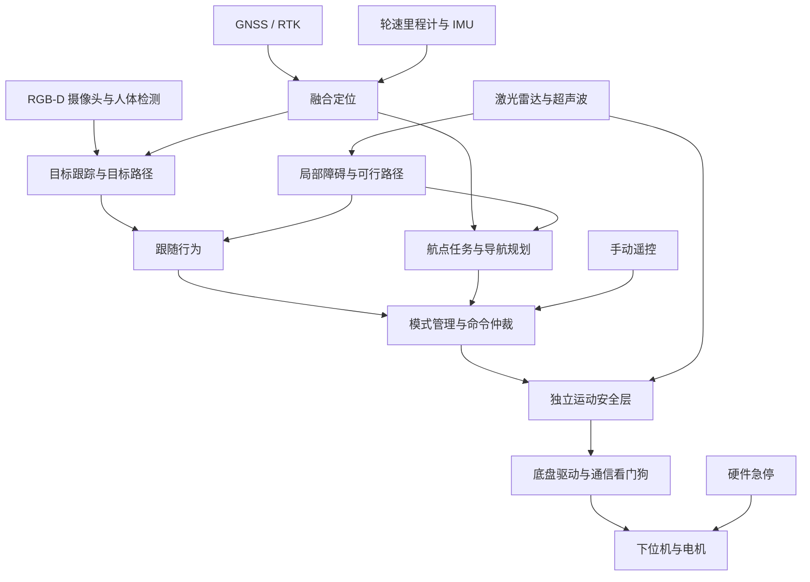

# 从人体跟随演进到卫星导航的架构建议

评审日期：2026-09-17。依据当前仓库代码进行静态评审，未连接开发板。
本文是设计建议，不表示以下模块已经实现；本次不改变运动控制行为。
“卫星自动驾驶”暂按封闭场地低速 GNSS/RTK 航点导航理解。

## 1. 当前基础与主要缺口

现有链路是 Astra RGB-D → YOLOv8n-pose → 多人跟踪 → 激光雷达关联与局部路径检查 → Wheeltec 阿克曼底盘。
仓库未发现超声波驱动或 `sensor_msgs/Range` 接入，也没有现行 GNSS 定位节点。

值得保留：NPU 最新帧推理、带时间的观测、多人关联、人体行走路径点、车体扫掠、刹车包络、底盘串口看门狗及独立防撞。
无需为了未来导航重写这些算法。

| 优先级 | 代码依据 | 改进方向 |
|---|---|---|
| P0 | `person_follower.py`、`radar_web_server.py` 都发布 `/cmd_vel`；驱动还接收 `/ackermann_cmd` | 所有运动来源先经模式管理与控制权仲裁，再进安全层。网页目前用杀跟随进程实现接管，不能代替控制权仲裁 |
| P0 | `scan_guard.py` 无扫描时直通、断流时仍允许最高 0.15 m/s；有效点为空时没有覆盖度判据 | 自主模式要求必要感知健康；未知区域不能当作无障碍。保留驱动兜底，补传感器健康和方向覆盖判据 |
| P0 | 超声波尚未接入 | 增加每路测距、有效状态、采样时刻和安装外参；首先用于近场限速与停车 |
| P1 | `person_follower.py` 约 1100 行，承担 ROS 适配、跟踪、控制、安全、脱困和遥测 | 按职责提取模块，先做进程内拆分，再将需要复用的跟踪和安全接口节点化 |
| P1 | 底盘发布 `/odom`，`person_tracker.py::OdomBuffer` 又从速度积分独立位姿 | 建立统一、连续的本地里程计与时间插值接口，跟踪和路径检查共享 |
| P1 | 车体尺寸、转向和制动参数散布于 follower、motion_safety、scan_guard、wheeltec.yaml | 单一机器人配置源，区分物理标定与任务策略，启动时交叉校验 |
| P1 | `start_all.sh` 每次禁用 mapping/mapping3d/rtk/foxglove；组件入口只接受 camera/lidar/ai/web/gui | 将历史服务清理移至一次性迁移；常规启动按 follow/outdoor 配置选择组件 |

补充：跟随节点自身已经会在雷达/底盘数据失效时停止，表中的感知缺口主要指共享底盘防撞层，不能据此认为当前所有跟随路径都无失效保护。
`docs/TUNING.md` 仍有旧距离、状态名及旧转弯半径，应随统一参数一起更新，避免现场按过时文档调车。

## 2. 推荐结构

核心边界：行为层决定期望运动；仲裁层决定谁有控制权；安全层只收紧运动许可；驱动负责协议、最终限幅和通信失效停车。
跟随、导航和手动控制全部走同一个安全出口。安全节点退出或失联时，驱动命令超时必须清零。
现有驱动内 ScanGuard 可继续做最后一道简化防线，避免拆分时丢失现有保护。

RK3588 负责视觉、跟踪、规划与网页；下位机/独立 MCU 负责确定时序的超声波采集、轮速控制和硬件保护。
如果超声波模块自带 UART/RS485 协议，RK3588 可直接读取串口；不建议用普通 Linux Python GPIO 忙等待测脉宽。

## 3. 当前阶段：摄像头配合超声波跟人

### 传感器分工

- 摄像头：确认是人、保持目标轨迹、提供方向；深度有效时提供人体距离。
- 激光雷达：保留现有测距关联、局部路径和转弯扫掠检查。已有硬件应继续利用。
- 超声波：补车头低位障碍、后方及侧角近场盲区，产生方向相关的速度上限或停车约束。

超声波波束通常较宽，返回值可能来自墙、桌腿或旁人，不能把“最近回波”直接写进人体轨迹。
首版不让超声波承担人体身份关联。相机没有可靠深度且激光无法可靠关联目标时，停车等待有效观测。
只有摄像头与超声波、没有激光雷达的配置需要单独的降级设计：先限于低速简单跟随、丢人停止，不继承现有激光地图证据和盲区倒车逻辑。

先按车身覆盖实测确定传感器数量与位置；前左/前中/前右和后左/后右可作为布置评估起点，而非未经验证的固定配置。
多探头要错峰触发并验证串扰，记录每路实际更新频率与端到端延迟。

### 超声波接口

每个探头发布 `/ultrasonic/<sensor>/range`，类型 `sensor_msgs/Range`：

- `header.stamp`：采样时间；`frame_id`：该探头独立坐标系。
- `radiation_type=ULTRASOUND`，距离单位米；填写实测/规格中的波束角、最小和最大量程。
- 使用明确的 TF 外参描述安装位置与方向。
- 配套诊断区分设备断开、测量失败、过近、超量程与正常测距。遵循 Range 消息语义；无法判定的无回波不能当作无限远空地。

安全层按运动方向选择必须健康的探头，并按波束覆盖范围作保守近场约束；超声波不能伪装成具有精确方位的激光点。
前进、倒车、转弯各自有覆盖要求。停车距离至少覆盖 `v × 总延迟 + v² / (2 × 实测保守减速度) + 余量`。
多传感器分别给出限制，最终取最严格的有效约束；不得平均距离来稀释近障碍。

### 首版行为与控制权

推荐首版开启低速跟随、停距控制、目标锁定、手动接管、丢人停止；将自动倒车和弧线搜索设为独立可选策略。
现有默认启用自动脱困；新超声波配置不能直接视为已经验证这些动作。

建议模式：`IDLE / MANUAL / FOLLOW / NAVIGATION / FAULT / ESTOP`。
模式切换先撤销旧控制租约、清除旧命令，必要时等实测停稳，再允许新来源；手动释放后不自动恢复旧的自主任务。
急停与严重故障锁存，需要明确解除。驱动的“可以接受命令”不等于任务层的“可以继续运动”。
当前驱动和跟随节点都有自动重新使能逻辑，改造时应与上述任务许可区分，防止旧任务在恢复通信后自行续跑。

## 4. 为 GNSS/RTK 导航预留的接口

卫星接收机提供绝对位置；自动导航还需要航向、连续局部位姿、路径规划、避障与任务管理。
建议使用 RTK GNSS + 轮速里程计 + IMU；精度需求由路线允许的横向误差决定，不能把普通单点定位当成厘米级定位。

统一坐标链：`map → odom → base_link → camera / lidar / ultrasonic / imu / gnss`。
延续当前 `base_link` 在后轴中心的约定，不应接导航时重新定义车体原点。

- `odom`：连续本地坐标，供跟踪、控制和短期路径历史使用，不随 GNSS 修正跳变。
- `map`：固定局部 ENU 地理坐标，用于地理航点和全局路线；GNSS 修正体现在 `map → odom`。
- GNSS 输出 `NavSatFix` 与接收机质量诊断：RTK fixed/float、差分龄期、位置方差等。标准 NavSatFix 状态不足以完整表达 RTK 解质量。
- 明确 GNSS 天线杆臂及 IMU 安装方向；按采样时间对齐传感器。
- 单天线 GNSS 的静止位置不能确定车头方向；现有 `/imu` 声明无姿态估计，不能直接当绝对航向。可评估双天线定向或经验证的航向初始化方案。

可采用 `robot_localization` 的本地/全局融合与 `navsat_transform_node`；接入前确认驱动里的速度和 IMU 是否有同源融合，避免把相关信息重复当独立观测。
如果本地 EKF 发布 `odom → base_link`，必须关闭当前驱动的同一 TF 发布，原始里程计仍可保留供融合。
跟踪器改为查询同一套带时间的本地位姿，超出可用历史范围时拒绝观测或按明确门限降级，不静默套用错误时刻的坐标。

早期室外需求若只是已知开阔路线的航点巡航，可先实现 ENU 航点路径与阿克曼路径跟踪。
路线需要绕障、重规划和任务行为树时，再引入 Nav2；规划器需满足最小转弯半径，控制器不能依赖原地旋转。
现有转角存在左前轮模型与自行车模型两种约定，必须统一物理定义并实车校准后再连接导航输出。
GNSS 跳点、RTK 降级、航向失效、越界应有明确停车/限速策略；首版建议定位质量不满足阈值即停车，不自动转为跟人模式。

## 5. 逐步实施与接口边界

| 阶段 | 具体工作 | 完成判据 |
|---|---|---|
| A：统一控制出口 | 引入 mode_manager / command_mux；手动与跟随迁到独立输入；驱动只接受安全出口；集中机器人参数 | 两来源并发时只有授权者有效；切换无残留命令；退出/重启不会自行恢复任务 |
| B：超声波接入 | 实现协议驱动、Range/诊断、TF、逐方向安全约束；保留现有激光跟随 | 探头拔掉、无回波、串扰、近障碍有明确响应；实测制动距离满足限速模型 |
| C：共享定位与部署 | 提取跟踪/控制接口；统一里程计缓存；补 ROS 包、launch、版本固定；启动配置分层 | 重启组件后坐标/时间不串；每个 TF 边只有一个发布者；室内启动不改写室外服务状态 |
| D：卫星航点导航 | GNSS/RTK 与航向、融合定位、航点任务、路线规划、地理围栏 | 定位跳点/失效停车；已知路线跟踪误差达标；沿用同一接管和安全出口 |

建议后续话题契约（不是当前已有接口）：

| 接口 | 建议语义 |
|---|---|
| `/follow/command`、`/manual/command`、`/navigation/command` | 带时间的运动请求，来源由独立通道确定；含速度、统一定义的转向量 |
| `/motion/selected` | 仲裁输出，附模式/租约代次；过期及切换前旧请求失效 |
| `/motion/safe` | 安全层最终输出；驱动唯一正常运动入口，部署时封闭旧入口的旁路 |
| `/tracking/target` | 强类型目标状态：时间、坐标系、轨迹 ID、位置/速度、协方差、来源、质量 |
| `/odometry/local` | 跟踪和局部控制共享的连续位姿 |
| `/safety/status` | 当前许可、限制来源、所需传感器健康、停车原因 |

时间戳使用 ROS 时间用于测量对齐，进程内看门狗使用单调时间；命令接收后还需本地有效期，不能只依赖 DDS 队列设置。
阿克曼请求可选用 `AckermannDriveStamped`；Nav2 的 Twist 输出经一个明确适配器转入统一模型。保留旧消息兼容时也必须先经仲裁和安全层。
内部先用 dataclass 明确契约，再迁到 ROS 自定义消息；网页 JSON 留在展示边界，避免一次性改动全部接口。

回放应补录原始超声波/诊断、原始里程计/IMU、TF、模式切换、仲裁前后指令和安全原因；导航阶段再加入 GNSS 与解质量。
现有轻量 bag 不含原始图像，只能验证检测结果之后的行为；视觉准确性验收另录有限时长的同步 RGB-D 数据。

## 6. 本次验证与待确定项

本次核对了启动脚本、视觉发布、跟踪、运动控制、网页接管、驱动防撞与里程计代码。
尝试 `python3 -m pytest tests -q` 时，本机默认 Python 3.14 缺少 pytest，未运行成功；本文不沿用旧文档的通过数量作为本次验证结论。
未执行上板部署、启动服务或运动指令。

超声波驱动落地前需要确认型号、数量、接口协议与安装位置；卫星导航阶段还需确认接收机、是否支持 RTK/定向、使用场地和期望路线精度。
这些信息不阻碍先做 A 阶段控制权与配置整理。
