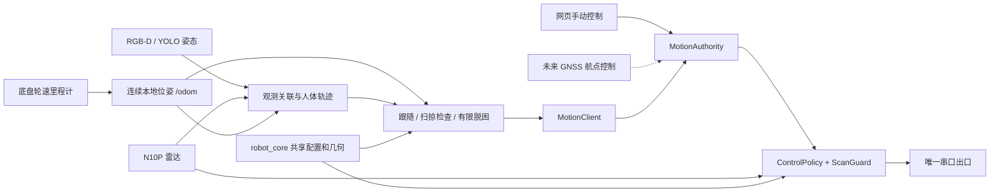

# 摄像头＋激光雷达跟随架构

更新：2026-09-18。本次完成当前跟随链路的架构重构；代码及发布包在本机验证，尚未部署或进行实车运动验收。需求是摄像头配合雷达，不使用超声波。GNSS/RTK 是后续功能，本次落实它需要的定位和控制接入边界。

2026-09-20：Jetson 正式跟随入口默认启用 MPPI＋CUDA，部署名称保留兼容。当前启动配置、性能优化与验证范围见 [Jetson MPPI](MPPI_JETSON.md)。

## 模块和数据流



| 代码 | 职责 |
|---|---|
| `robot_core/robot.json`、`config.py` | 机器人尺寸、外参、帧名、物理限制、超时、手动档位；启动时校验 |
| `robot_core/kinematics.py` | 网页、跟随、底盘共用的转角与角速度换算 |
| `robot_core/contracts.py`、`odometry.py` | 与 ROS 无关的观测契约、连续位姿历史及插值 |
| `person_follower.py` | 约 200 行 ROS 适配：消息转换、时钟、订阅、控制租约、发布 |
| `follower_engine.py` | 唯一跟随状态持有者；注入时钟与遥测出口，可脱离 ROS 测试 |
| `follower_perception.py`、`person_tracker.py` | 相机/雷达观测、同一里程计坐标下的关联、目标身份 |
| `follower_controller.py`、`follower_recovery.py` | 跟随、转向、K-turn、扫掠验证、有限脱困；不直接操作底盘 |
| `follower_telemetry.py`、`follower_config.py` | 状态序列化、终端显示、行为参数 |
| `motion_client.py` | 带时效、配置摘要、控制租约的行为请求 |
| `wheeltec_protocol/motion_authority.py` | 手动/跟随/导航仲裁、超时和故障锁存 |
| `wheeltec_driver.py`、`scan_guard.py` | 串口、原始里程计、最终限幅和雷达防撞；唯一执行出口 |
| `deployment/manage.py` | 完整发布目录、内容校验、服务切换、失败回滚 |

纯算法模块没有 ROS、进程管理或执行器调用。现有人体锁定、雷达接力、纯追踪、车体扫掠和 K-turn 保留；算法状态只在一个 engine 内维护。网页暂停或手动接管不再杀掉跟随进程。托管部署中跟随进程由 systemd 唯一管理，网页启动请求也交给同一服务，避免进程检测与自动重启竞争。

## 唯一配置与统一位姿

所有 ROS 入口经 `radar_system/ros_env.sh` 加载：默认使用 `/etc/rk3588/runtime.env`，也可在启动进程设置 `ROBOT_RUNTIME_ENV` 指向其他文件。优先级为进程变量 → 文件 → 默认值；默认文件不存在时继续，显式文件不存在、不可读或格式错误时退出。配置文件是 systemd `EnvironmentFile` 风格的赋值（可用引号，`$`/反引号不会展开），不能写 `source`、`export` 或命令。服务单元不再另行加载该文件。显式 `ROS_DISTRO` 只能为 `humble`/`jazzy` 且必须存在；未设置按 Humble → Jazzy 选。`RK3588_PYTHON` 默认 `/usr/bin/python3`，错误路径不会回退。服务日志给出最终选择。

所有组件默认读取 `robot_core/robot.json`，也可在上述文件设置 `RK3588_ROBOT_CONFIG=/etc/rk3588/robot.json` 指向同一外部配置。相机深度标定由 `RK3588_DEPTH_PATH_CONFIG` 选择，默认 `/etc/rk3588/depth_path.json`；模型由 `RK3588_POSE_MODEL` 选择，默认随包提供的 `radar_system/models/yolo26s.pt`（Jetson CUDA FP16，人物检测）。建议在环境文件中用绝对路径；相对模型路径一律相对 `radar_system`，不随启动目录变化。修改后重启整套服务。配置摘要随驱动状态和运动请求发送，摘要不一致的请求拒绝执行。底盘拒绝与共享物理配置冲突的 ROS 参数覆盖；跟随 CLI 同样拒绝单独修改物理标定。

雷达按标准协议发布方向：前方 0°、左侧 90°、后方 180°、右侧 270°。`sensors.raw_lidar_yaw_deg` 默认回到 0°；只有现场完成实测标定后才填写偏移，不能在跟随层重复叠加。旧 `radar_system/config/lidar_calib.json` 已迁移，不再读取。

`base_link` 原点为后轴中心，x 向前、y 向左。当前底盘发布 `/odom` 和 `odom → base_link`；人体轨迹、路径历史和脱困距离全部使用同一份时间戳位姿。跟随进程不再自行对速度积分。相机按采集时间对齐位姿，超时、缺时间戳或超出历史的观测丢弃；雷达龄期也按采集时间计算。

位姿帧名错误、异常跳变、长时间断流或底盘 `odometry_epoch` 改变，会清除不再可信的目标/机动/路径历史。位姿过期时跟随输出零。默认历史长 3 秒，端点保持最多 0.12 秒；这不是预测车辆继续运动。

`localization.driver_topic` 是底盘原始输出，`localization.topic` 是行为实际消费的本地定位，两者当前都是 `/odom`。以后可保持前者不变，把后者设为融合定位话题。只有测试及显式旧包回放允许速度积分。

## 控制契约

| 话题或服务 | 类型 | 含义 |
|---|---|---|
| `/follow/command` | `std_msgs/String` JSON | 跟随请求 |
| `/manual/command` | 同上 | 手动请求，可接管自主任务 |
| `/navigation/command` | 同上 | 导航请求 |
| `/motion/status` | 同上，5 Hz | mode、epoch、profile_hash、healthy、reason、waiting_stationary、command |
| `/motion/follow`、`/motion/navigation` | `std_srvs/SetBool` | 显式选择或释放对应任务 |
| `/motion/stop`、`/wheeltec/stop` | `std_srvs/Trigger` | 锁存 ESTOP，清零输出 |
| `/motion/reset` | `std_srvs/Trigger` | 健康且停稳后复位为 IDLE |

请求包含 `vx`（m/s）、`wz`（rad/s）、`stamp`（ROS 秒）、`epoch`、`profile_hash`。租约用于废弃排队旧请求，不是网络认证；ROS 域仍需可信。

- 启动为 IDLE。收到自主速度不会自行选择任务；模式切换更新租约。
- 手动接管先清零，等待实测连续停稳 0.30 秒；底层另检查静止反馈。
- 请求发送龄期及有效期不超过 0.35 秒；未来、过期、重复、乱序、非有限值拒收。
- 手动松手或命令断流回到 IDLE，不自动恢复之前的跟随。
- 雷达、底盘反馈、电池健康门控覆盖全部来源。不健康时当周期立即清零且丢弃旧请求；短于 1 秒的调度/USB 抖动恢复后只接受新指令，持续故障才锁存 FAULT。锁存后数据恢复仍需显式 reset。
- 当前雷达门控要求扫描小于 0.5 秒且至少 10 个外部有效点；电池至少 21 V。这不代表已经证明各个方向都有完整覆盖。
- 所有来源经过 ScanGuard 和驱动限幅。防撞限速同时调整角速度，限制实际输出曲率。
- `armed` 表示底层就绪，不表示拥有任务运动权限。`command` 是仲裁请求，最终输出见 `/wheeltec/status.output_speed_turn`，实测见 `telemetry.velocity`。

默认 `legacy_commands: false`，不订阅旧 `/cmd_vel` 和 `/ackermann_cmd`。显式 legacy 调试模式与新租约入口互斥，不支持混跑新旧控制栈。

## 运行、部署和回滚

Jetson 需要已有 ROS 2 Humble/Jazzy、Astra/OpenNI2 相机驱动、配套的 CUDA PyTorch/torchvision 和 Ultralytics 8.4+、Python NumPy/OpenCV/pyserial，以及 ROS 消息依赖。默认 `.pt` 权重已随包提供，无需预先构建引擎；如果显式选择 `.engine`，应在目标 Jetson 上用匹配的 TensorRT 导出，直接由 Ultralytics 加载，不依赖自定义包装库。RK3588 兼容部署须显式提供旧 RKNN 模型与 NPU runtime，并选择纯追踪；旧 ONNX CPU 路径也须显式提供对应四输出权重。这两种旧权重不再随当前 Jetson 包提供。不因缺少产物或运行库自动切换后端。发布器打包项目代码和已有模型，不安装系统驱动或固件。

本机生成一个不可覆盖的完整发布目录：

```bash
python3 deployment/manage.py stage artifacts/follow-release
python3 deployment/manage.py verify artifacts/follow-release
```

发布目录包含 `robot_core`、`radar_system`、`wheeltec_protocol`、`deployment` 、说明文档和带 SHA256 的清单。验证检查文件集合、内容、Python 语法和配置有效性。将完整目录复制到开发板，例如 `/opt/rk3588/releases/follow-release`，在板端执行：

```bash
sudo python3 /opt/rk3588/releases/follow-release/deployment/manage.py activate \
  /opt/rk3588/releases/follow-release --profile headless
```

激活先停止命名的旧服务，备份原服务单元及 `current` 指向，再切换 `/opt/rk3588/current`，重建服务并启动。启动失败时还原服务与版本，保持停车。回滚同样保持停止，避免旧程序自动恢复任务：

```bash
sudo python3 /opt/rk3588/current/deployment/manage.py rollback
```

三个启动配置：`perception` 为底盘＋相机＋雷达＋AI＋网页；`headless` 再加被动跟随进程；`follow` 再加板载 GUI。启动服务不会选择 FOLLOW；网页点击跟随或调用服务后才申请控制权。发布器不自动启用开机启动。旧版如果还在独立终端运行，迁移前应停止，确保串口及 TF 只有一个拥有者。

安装后 `bash radar_system/start_all.sh headless` 可启动已有服务，`stop_all.sh` 停止。直接运行 `run_follower.sh` 会发起一次显式跟随选择；`--passive` 只等待选择，`--dry-run` 只计算不发运动请求。避免与服务重复启动跟随节点。

可选现场配置：复制 release 的 `robot_core/robot.json` 到 `/etc/rk3588/robot.json`，在 `/etc/rk3588/runtime.env` 写入 `RK3588_ROBOT_CONFIG=/etc/rk3588/robot.json`。使用共享入口 `bash radar_system/run_calib_check.sh` 和 `bash radar_system/calibrate_lidar.py` 进行标定；校准工具修改这份外部配置，保持发布目录不可变。外部现场标定文件不随代码回滚；更换硬件或配置结构时要单独核对。

```bash
ros2 topic echo /motion/status
ros2 service call /motion/stop std_srvs/srv/Trigger '{}'
ros2 service call /motion/reset std_srvs/srv/Trigger '{}'
ros2 service call /motion/follow std_srvs/srv/SetBool '{data: true}'
```

网页提供 `POST /api/motion/stop`、`POST /api/motion/reset`。服务响应超时需检查状态，不能当作操作成功。CLI `bash wheeltec_protocol/run_control.sh drive` 使用同一手动入口且检查配置一致性；结束会锁存停车，再次运动前需 reset。

## GNSS/RTK 接入边界

后续增加卫星驱动、轮速/IMU/GNSS 融合、质量诊断、航点任务及规划器。保持连续本地定位在 `odom`，卫星绝对修正放在 `map → odom`；若融合节点接管 `odom → base_link`，关闭底盘 YAML 的 `publish_tf`，不能同时发布两份动态 TF。

导航行为消费融合本地定位及障碍物观测，显式选择 NAVIGATION 后通过 `MotionClient(node, 'navigation')` 发 SI 速度请求，仍经过停稳切换、故障门控和防撞出口。导航与 FOLLOW 互斥，手动可接管两者。定位丢失/质量不足由导航行为停止请求；卫星坐标不能直接当作人体跟随的局部位姿。

这次没有虚构卫星接收机协议、天线外参或航向来源，也没有实现尚未选型的 GNSS 驱动和航点规划器。上述接入无需重写当前跟随和底盘接口。

## 验证范围

本机完整测试为 **365 项通过、7 个历史模块跳过**（Python 3.11 / NumPy 1.26.4）。运行 `python3 -m pytest tests -q`。覆盖原有跟随/视觉/扫掠场景、控制权状态机、实际驱动 policy 联动、手动接管、时效和配置隔离、外部里程计跟随及断流恢复、里程计跳变、共享运动学、发布包篡改检测和启动失败回滚。

7 个历史 cloud/map 测试模块对应的实现早已删除，现显式标记跳过；恢复实现后这些测试会自动重新参与。测试使用 ROS 替身、合成观测和模拟 systemd，不涉及实际 DDS、NPU 或电机。物理转向约定、实车制动、传感器覆盖和板端运行性能仍需现场验证。
